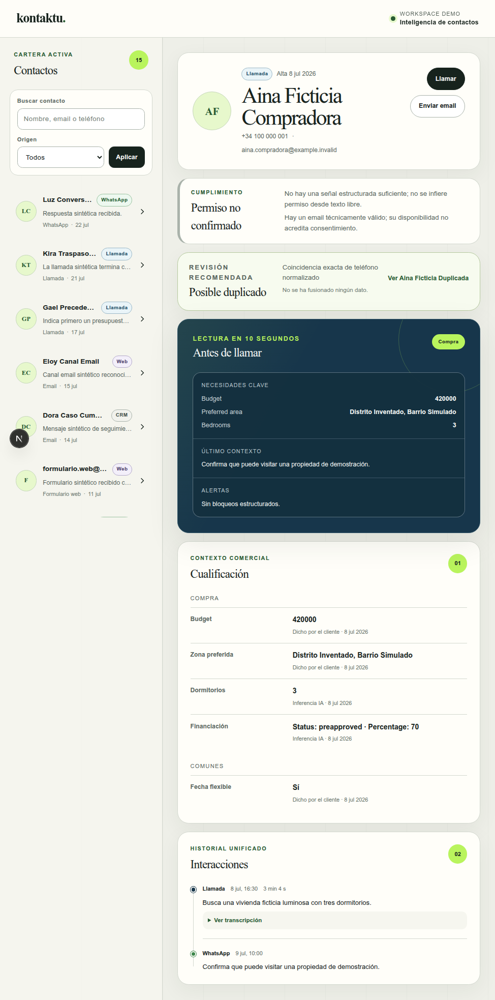
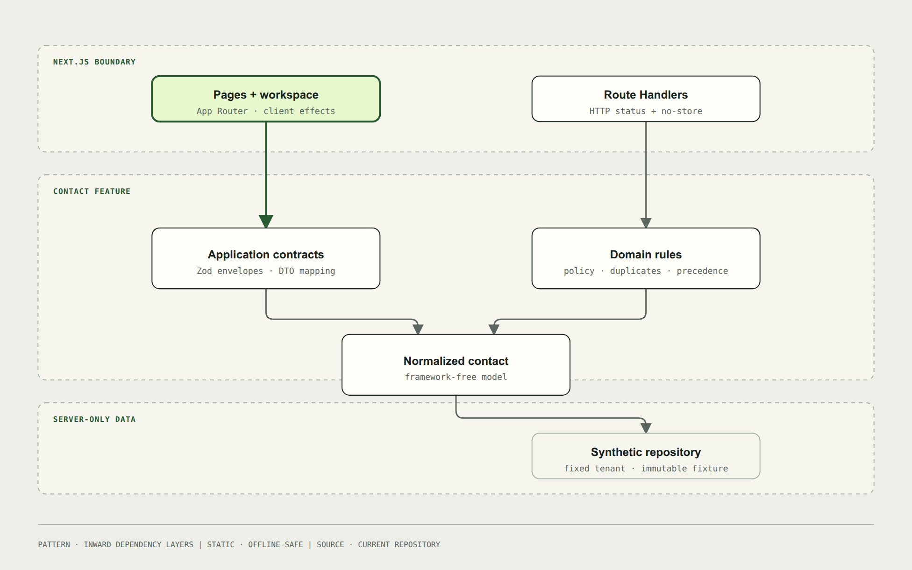
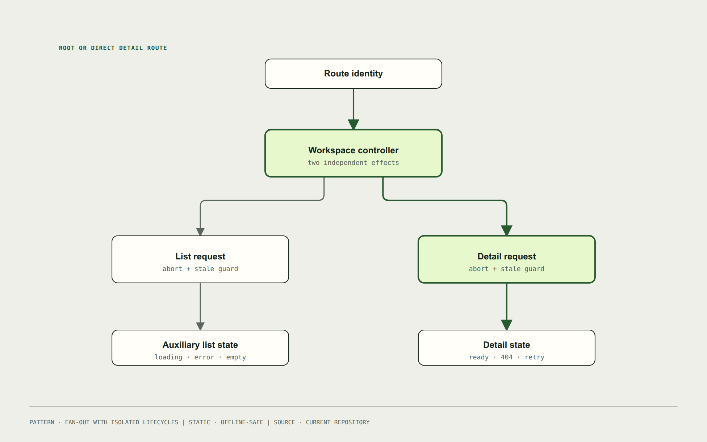
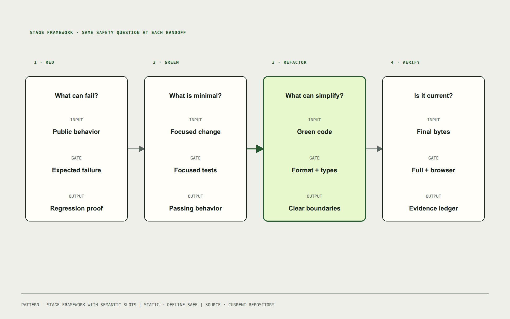
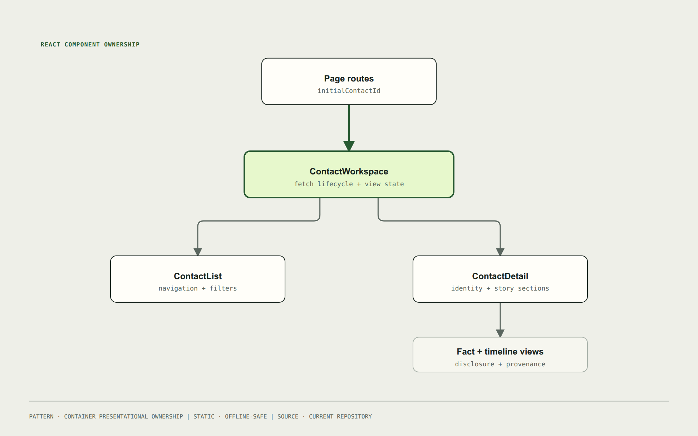
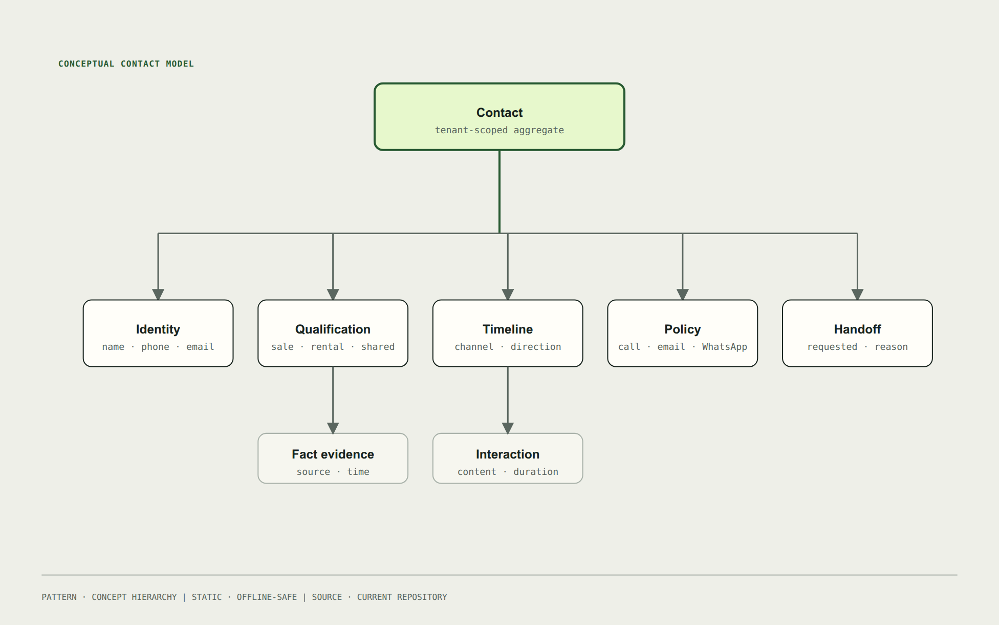

# Contact intelligence that stays trustworthy when the data does not

[](https://github.com/ralabarta/kontaktu/actions/workflows/ci.yml)


Kontaktu is a reviewer-ready contact workspace for an AI-first real-estate CRM. It turns heterogeneous voice, WhatsApp, web, CRM, Meta, and manual records into a useful contact detail without hiding uncertainty, inventing consent, or assuming tomorrow's qualification fields are known today.

The detail—not the auxiliary list—is the product. Open a contact and an agent can understand identity, qualification provenance, interaction history, call restrictions, and the next human context in seconds.

> **Time-box disclosure:** this portfolio-quality iteration intentionally exceeded the original challenge's 1–2 hour limit. It should not be presented as time-box compliant. Exact elapsed time was not instrumented, so no smaller figure is claimed. AI-assisted development was used throughout and is described below.

## Review path

1. Scan the [three product stories](#three-stories-selected-on-purpose) and [R1–R9 coverage](#requirements-coverage).
2. Run the [quick start](#quick-start), then open the rich and restricted contacts.
3. Review the shared runtime contract in [`contact-api.schema.ts`](src/features/contacts/application/contact-api.schema.ts) and the [API guide](docs/api.md).
4. Check the current [verification evidence](docs/verification.md) and [repository metadata proposal](docs/repository-metadata.md).

## Verification at a glance

The final local candidate completed its archived SDD scope with no blocking findings. These results identify local evidence; the GitHub-hosted CI result remains unclaimed until the workflow runs remotely.

| Evidence              | Result                                                                              |
| --------------------- | ----------------------------------------------------------------------------------- |
| SDD traceability      | 15/15 tasks, 12/12 requirements, and 12/12 scenarios verified                       |
| Automated tests       | 70/70 Vitest, 5/5 privacy, and 7/7 Chromium E2E tests passed                        |
| Browser review        | 31 checks across rich, sparse, restricted, and not-found states; 8 axe scans passed |
| Coverage              | 91.12% statements, 85.96% branches, 91.73% functions, and 93.68% lines              |
| Engineering gates     | Format, typecheck, lint, build, privacy, CI structure, and Git diff checks passed   |
| Architecture evidence | Graphify validated 391 nodes, 578 edges, no ambiguous edges, and no import cycles   |
| Diagram evidence      | Five canonical HTML/SVG/PNG packages passed the pinned `diagram-design` self-check  |
| Independent verdict   | **PASS WITH WARNINGS** — 0 critical findings and no blockers                        |

Two non-blocking warnings remain explicit rather than hidden: App Router shell files are exercised through browser E2E but have no Vitest instrumentation, and several request-lifecycle tests intentionally assert `fetch` call counts, coupling them to orchestration details. Cross-browser and assistive-technology sessions remain future evidence, not current claims.

## Current UI

The screenshots below were captured from the current local application during W5 verification. The records, phone numbers, email addresses, and conversations are synthetic.




## Quick start

### Prerequisites

- Node.js 20.9 or newer
- pnpm 10.33.0 (the repository pins the package manager)

```bash
pnpm install --frozen-lockfile
pnpm dev
```

Open <http://localhost:3000>. Useful review routes:

| State                                          | Route                                            |
| ---------------------------------------------- | ------------------------------------------------ |
| Rich contact and reciprocal duplicate evidence | <http://localhost:3000/contacts/demo-contact-01> |
| Sparse contact with dignified fallbacks        | <http://localhost:3000/contacts/demo-contact-04> |
| Structured no-call evidence and human handoff  | <http://localhost:3000/contacts/demo-contact-07> |
| Indistinguishable not-found state              | <http://localhost:3000/contacts/demo-contact-99> |

All public fixtures are synthetic and explicitly marked as test data.

## Product framing

Real contact data is irregular: names and dates are missing, phones arrive in multiple formats, channels use inconsistent labels, interactions use different timestamp formats, and qualification contains values the UI did not know about when it was built. The workspace treats that mess as a product constraint rather than a rendering exception.

The implementation prioritizes:

- **Trust before automation:** show provenance, currentness, and uncertainty.
- **Fast preparation:** put actionable context before exhaustive history.
- **Safe behavior:** structured restrictions can block calls; free text and email availability cannot manufacture consent.
- **Graceful sparsity:** an almost-empty contact still has useful identity and state language.

## Three stories selected on purpose

Exactly three of the challenge's open stories are implemented.

| Story                   | Outcome                                                                                                                                                     | Why this one                                                                                                                           |
| ----------------------- | ----------------------------------------------------------------------------------------------------------------------------------------------------------- | -------------------------------------------------------------------------------------------------------------------------------------- |
| **Possible duplicates** | Same-tenant contacts with normalized matching phone or actionable email show reciprocal, explainable evidence. The UI offers review, never automatic merge. | Duplicate records damage agent context, but an irreversible merge would be unsafe without persistence, audit, and conflict resolution. |
| **Before-call view**    | A compact card summarizes operation, key needs, latest context, and blockers for a ten-second read.                                                         | It directly serves the central job: preparing an agent before a call.                                                                  |
| **Compliance**          | Structured `no-llamar` evidence blocks calling; email remains only technically available; human handoff is shown separately.                                | Incorrect outreach has higher cost than a missing convenience feature, and legal truth must not be inferred from free text.            |

Not selected: data-health scoring, contact actions, next-best action, editing, full heterogeneous search, LLM summaries, and property matching.

## Dirty-data, precedence, and privacy decisions

| Problem                                     | Decision                                                                                                                                                                    |
| ------------------------------------------- | --------------------------------------------------------------------------------------------------------------------------------------------------------------------------- |
| Missing name                                | Fall back to readable phone, then email, then a neutral label; initials remain deterministic.                                                                               |
| Inconsistent channels                       | Normalize known aliases into a small canonical source/channel vocabulary; preserve an explicit `unknown`.                                                                   |
| Unknown qualification keys and mixed values | Render recursively and group by sale, rental, or shared operation instead of maintaining a fixed form.                                                                      |
| Conflicting evidence                        | Human evidence outranks customer evidence, which outranks AI evidence; recency breaks ties. Input history order is preserved, and only the actual winner is marked current. |
| Ambiguous dates                             | Parse supported inputs, emit ISO DTO timestamps, and format all contact dates in `Europe/Madrid` with `es-ES`. Null or invalid values use explicit pending language.        |
| Zero duration                               | `0` is a valid measured duration and renders as `0 s`; only `null` means absent. Negative values are rejected during normalization.                                         |
| Compliance                                  | Only structured no-call evidence blocks calls. Email validity is not consent, free text is not legal evidence, and handoff is an independent operational state.             |
| Duplicate visibility                        | Compare only contacts in the current tenant. Hidden-tenant and unknown IDs return the same not-found response.                                                              |
| Personal data                               | The public fixture is synthetic, payloads are not logged, responses are `no-store`, and DTOs expose only presentation needs.                                                |

## Architecture and boundaries

```text
Next.js page / Route Handler
        ↓
UI workspace + independent list/detail request lifecycles
        ↓
application DTO mapping, runtime schemas, policies, normalization
        ↓
framework-free contact domain
        ↓
server-only repository over a synthetic immutable fixture
```

Dependencies point inward. Next.js request/response objects stop at Route Handlers; Zod validates transport success envelopes at server output and client input; UI receives parsed DTOs; the repository is the only layer that imports fixture data. List and known-ID detail requests are independent, so a slow or failed list cannot suppress a direct detail.

Key review locations:

- [`src/app/api/contacts`](src/app/api/contacts): HTTP validation and status mapping.
- [`src/features/contacts/application`](src/features/contacts/application): normalization, policies, duplicate detection, DTO mapping, and shared schemas.
- [`src/features/contacts/domain`](src/features/contacts/domain): framework-free contact model.
- [`src/features/contacts/data`](src/features/contacts/data): server-only tenant boundary and fixture access.
- [`src/features/contacts/ui`](src/features/contacts/ui): presentation and request lifecycle.
- [`tests`](tests): unit, integration, privacy, and browser behavior.

## System diagrams

Each preview links to its canonical offline HTML. Accessible SVG is available for vector review, and the full [tool lock](docs/diagrams/tool-lock.md) and [validation/fidelity ledger](docs/diagrams/validation.md) record generation and current results.

[](docs/diagrams/architecture.html)

[Canonical HTML](docs/diagrams/architecture.html) · [Accessible SVG](docs/diagrams/architecture.svg)

[](docs/diagrams/request-flow.html)

[Canonical HTML](docs/diagrams/request-flow.html) · [Accessible SVG](docs/diagrams/request-flow.svg)

[](docs/diagrams/verification-process.html)

[Canonical HTML](docs/diagrams/verification-process.html) · [Accessible SVG](docs/diagrams/verification-process.svg)

[](docs/diagrams/components.html)

[Canonical HTML](docs/diagrams/components.html) · [Accessible SVG](docs/diagrams/components.svg)

[](docs/diagrams/domain.html)

[Canonical HTML](docs/diagrams/domain.html) · [Accessible SVG](docs/diagrams/domain.svg)

## Requirements coverage

| Requirement                         | Evidence in the implementation                                                                                                                          |
| ----------------------------------- | ------------------------------------------------------------------------------------------------------------------------------------------------------- |
| **R1 — navigable list**             | API-backed identity/source/latest-interaction list with detail links; filters are auxiliary and not described as full search.                           |
| **R2 — robust identity**            | Name fallback, initials, normalized source, readable phone, and Madrid-explicit date formatting.                                                        |
| **R3 — dynamic qualification**      | Unknown keys, mixed values, operation groups, provenance, timestamps, and precedence-derived current markers.                                           |
| **R4 — chronological interactions** | Calls, WhatsApp, forms, and email share one timeline; summaries remain visible, transcripts disclose on demand, and zero seconds is visible.            |
| **R5 — resilient states**           | Loading, retryable errors, empty list, sparse detail, and tenant-safe not found; direct detail loads independently.                                     |
| **R6 — documented decisions**       | This README records scope, data policy, AI workflow, tradeoffs, evidence, and time-limit ineligibility.                                                 |
| **R7 — Kontaktu quality**           | Supplied visual language, responsive master/detail flow, semantic controls, keyboard path, focus handling, reduced motion, and current manual evidence. |
| **R8 — API boundary**               | Route Handlers serve list/detail JSON; shared strict Zod schemas validate successful server and client payloads.                                        |
| **R9 — maintainability**            | Feature-first boundaries and public-behavior tests isolate normalization, policy, DTO, transport, and UI changes.                                       |

## API

The executable guide is in [`docs/api.md`](docs/api.md).

```bash
curl --fail-with-body "http://localhost:3000/api/contacts?q=Aina&source=voice"
curl --fail-with-body "http://localhost:3000/api/contacts/demo-contact-01"
```

Both success routes return JSON and `Cache-Control: no-store, max-age=0`. Invalid query/ID input returns `400`, unknown or cross-tenant detail returns `404`, and unexpected failures return `500` using the documented error envelope.

## Testing strategy

The test pyramid is deliberate:

- **Pure unit tests** lock down dirty-data normalization, precedence, date determinism, policy, duplicates, and DTO behavior.
- **Component tests** assert user-visible states, request races, retry behavior, disclosure controls, and malformed-success recovery.
- **Route integration tests** exercise query validation, tenant non-disclosure, status envelopes, and the same Zod success contracts used by clients.
- **Privacy checks** reject raw sensitive values and require public fixtures to stay synthetic.
- **Playwright checks** cover navigation, direct links, selected stories, not found, mobile flow, keyboard focus, transcript disclosure, and axe.
- **Manual review** checks representative layouts, focus visibility, disclosure clarity, privacy, and fidelity against available references.

Current local command results and the evidence class for each check are reported in [`docs/verification.md`](docs/verification.md). The final local matrix passed 70/70 coverage tests, 7/7 Chromium journeys, and the official 5/5 diagram self-check alongside format, type, lint, privacy, build, and diff gates. The deterministic [CI workflow](.github/workflows/ci.yml) mirrors that automated matrix with a frozen install and Chromium; remote workflow success is not claimed until GitHub runs it.

## AI-assisted workflow and mistakes caught

AI was used to explore the code graph, draft tests and implementation changes, and structure review documentation. It was not treated as verification. Each behavior change started from a failing regression, then used focused execution and current browser evidence.

Concrete mistakes caught by tests and review:

1. **Array position was mistaken for truth.** The UI marked the last evidence entry current even when human precedence selected another entry.
2. **Truthiness erased valid data.** A zero-second call duration disappeared because `0` was treated as absent.
3. **TypeScript assertions were mistaken for runtime safety.** Malformed HTTP `200` payloads could cross the client boundary until shared Zod parsing was added.
4. **List completion controlled detail loading.** A direct detail URL waited for the list and could be overwritten by stale responses.
5. **Runtime locale was mistaken for product timezone.** The same timestamp rendered different dates under UTC and New York until formatting was centralized on Madrid.
6. **Generated framework types masked a clean-checkout failure.** The dynamic route depended on a `.next`-generated global `PageProps`; remote CI exposed it, and the route now declares its input contract explicitly.

The lesson is operational: generated code is a hypothesis; contracts, race tests, timezone tests, clean-checkout CI, browser checks, and human inspection decide whether it is true.

## Tradeoffs

- The immutable local repository is intentionally simple; adding ports or a query library would create abstraction without a second implementation.
- Full search, pagination, editing, and persistence are absent. The list filter is a review aid, not a production search claim.
- Duplicate detection is deterministic and conservative; it cannot resolve household/shared-address ambiguity and therefore never merges.
- Zod schemas are hand-authored and shared rather than generated from OpenAPI. This keeps one runtime contract without introducing tooling for a two-endpoint challenge.
- Browser coverage uses Chromium only. Cross-browser and assistive-technology sessions remain follow-up work.
- Visual fidelity is recorded as manual evidence, not presented as pixel-perfect certification.

## Explicitly out of scope

Data-health scoring, call/WhatsApp execution, next-best action, fact editing, full heterogeneous search, LLM summaries, property matching, LiveKit, deployment, persistence, automatic merging, and remote repository mutation.

## With one more day

I would add production-grade tenancy/authentication around the repository port, persistence and audit trails for human corrections and merge proposals, contract-level pagination, cross-browser and screen-reader sessions, visual-regression baselines, observability without payload logging, and performance budgets for larger timelines. I would also observe the first GitHub-hosted CI run before publishing a badge or repository status claim.
